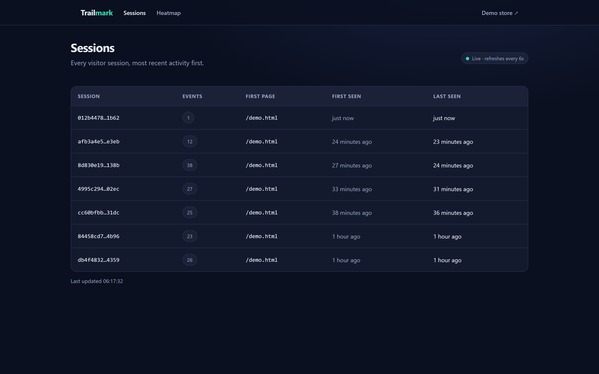

# Trailmark — User Analytics

A small full-stack analytics app that tracks user interactions (page views + clicks)
on any webpage via a drop-in script, and visualizes them as **sessions**, **user
journeys**, and a **click heatmap**.

> **🔗 Live demo:** https://trailmark-analytics.vercel.app
> **Demo store** (click around to generate data): https://trailmark-analytics.vercel.app/demo.html
> **Dashboard:** https://trailmark-analytics.vercel.app/dashboard
> **Heatmap:** https://trailmark-analytics.vercel.app/dashboard/heatmap

<!-- Add a screenshot / GIF here once deployed:

-->

---

## What it does

- **`public/analytics.js`** — a framework-free tracker you embed with one tag:
  `<script src="/analytics.js"></script>`. It records a `page_view` on load and
  every `click` (with document-relative coordinates), batches them, and ships them
  reliably to the backend.
- **API (Next.js Route Handlers)** — receives/validates events, and serves derived
  sessions, single-session journeys, and heatmap click data straight from MongoDB.
- **Dashboard (React, App Router)** — a live-refreshing sessions list, a per-session
  timeline, and a canvas gradient heatmap.

---

## Tech stack

| Layer        | Choice                                                      |
| ------------ | ---------------------------------------------------------- |
| Framework    | Next.js 14 (App Router) — frontend + backend in one app    |
| Backend      | Next.js Route Handlers (`app/api/*`)                        |
| Database     | MongoDB Atlas (M0) via the official `mongodb` Node driver  |
| Tracking     | Vanilla JS static asset (`public/analytics.js`)            |
| Hosting      | Vercel                                                      |

No Mongoose, no Atlas Data API, no Express, no Docker/Redis/queues in production.

---

## Project structure

```
app/
  api/
    events/route.ts          POST: validate + store event(s)
    sessions/route.ts        GET:  sessions list (Mongo aggregation)
    sessions/[id]/route.ts   GET:  ordered events for one session
    heatmap/route.ts         GET:  click data for a page URL + URL list
  dashboard/
    page.tsx                 Sessions view (auto-refresh)
    sessions/[id]/page.tsx   User-journey timeline
    heatmap/page.tsx         Heatmap view
  page.tsx                   Landing page
lib/
  mongodb.ts                 Cached connection singleton
  types.ts                   Shared Event / Session types
  validation.ts              Event payload validation
  format.ts                  Time/URL display helpers
components/                  SessionList, EventTimeline, Heatmap, TopBar
public/
  analytics.js               The tracking script
  demo.html                  Standalone demo store using the script
scripts/
  setup-indexes.ts           Create the indexes that power the queries
  seed.ts                    Seed realistic sessions so the dashboard isn't empty
```

---

## Local setup

**Prereqs:** Node 18+ and a MongoDB you can reach (local or Atlas).

```bash
# 1. install
npm install

# 2. configure env
cp .env.example .env.local
# edit .env.local — for local Mongo the default works:
#   MONGODB_URI=mongodb://127.0.0.1:27017

# 3. (optional) start a local MongoDB with Docker
docker compose up -d

# 4. create indexes (one-time)
npm run setup-indexes

# 5. (optional) seed demo data so the dashboard isn't empty
npm run seed

# 6. run
npm run dev
```

Then open:

- `http://localhost:3000/demo.html` — click around the demo store
- `http://localhost:3000/dashboard` — watch sessions appear live

### Quick API smoke test

```bash
curl -X POST http://localhost:3000/api/events \
  -H "Content-Type: application/json" \
  -d '{"sessionId":"test-1","type":"page_view","url":"http://localhost:3000/demo.html","timestamp":"2026-06-24T05:00:00.000Z"}'
# -> {"inserted":1}  (201)

curl http://localhost:3000/api/sessions
```

---

## Database

Single collection: **`events`**. Sessions are *derived* via aggregation on
`sessionId` (no separate `sessions` collection). Indexes (`npm run setup-indexes`):

- `{ sessionId: 1, timestamp: 1 }` — session timeline query
- `{ url: 1, type: 1 }` — heatmap query
- `{ sessionId: 1 }` — sessions-list aggregation grouping

Event shape:

```ts
interface AnalyticsEvent {
  _id: ObjectId;
  sessionId: string;
  type: "page_view" | "click";
  url: string;
  timestamp: string;            // ISO 8601
  // click-only:
  pageX?, pageY?: number;       // document-relative
  viewportWidth?, viewportHeight?: number;
  pageWidth?, pageHeight?: number;
}
```

---

## Assumptions & trade-offs (deliberate decisions)

- **`localStorage` over cookies for the session ID.** The ID is only ever read by
  client JS to tag outgoing events — it never needs to travel on HTTP requests, so a
  cookie would just add request overhead (and cookie-consent surface area). It also
  keeps the tracker fully client-side and embeddable on any origin.
- **30-minute inactivity session reset.** A stored `lastActivityTimestamp` is checked
  on load; if the gap exceeds 30 min a fresh session ID is minted. This matches the
  industry-standard sessionization window (a returning user the next day is a new
  session, not one giant infinite session).
- **`pageX/pageY` + page-dimension normalization, not raw pixels.** Clicks store
  document-relative coordinates plus the viewport and full-page size at click time.
  The heatmap positions each click by `pageX / pageWidth` (a percentage), so clicks
  captured on a laptop and a widescreen still land in the same *relative* spot instead
  of clustering wrong or falling off-canvas. `clientX/Y` would break the moment the
  page is scrolled or viewed at a different size.
- **`sendBeacon`-based reliable delivery over plain `fetch`-per-click.** Events are
  queued and flushed in batches (every 5 events / 4s), and crucially flushed on
  `visibilitychange`/`pagehide` via `navigator.sendBeacon` (with a `fetch(keepalive)`
  fallback). Firing one `fetch` per click drops the last events when a user navigates
  away — exactly when the most interesting events (the click that left) happen.
- **Next.js full-stack over a separate Express backend.** One deployable, one origin
  (no CORS), shared TypeScript types across API and UI, and Route Handlers give real
  request/response control. For this scope an extra Express server would be pure
  overhead.
- **Single `events` collection, sessions derived via aggregation.** Avoids
  dual-write consistency problems; the sessions list is a `$group`, not a second
  source of truth.

### What I'd add with more time

- Richer event types (scroll depth, form/field interactions, rage-clicks).
- Cross-device/session linking once a user authenticates (currently sessions are
  intentionally device-local — no cross-device merging, per scope).
- A real screenshot/wireframe background behind the heatmap instead of a neutral
  panel, and per-element click attribution.
- Pagination / date filtering on the sessions list and server-side aggregation
  caching for large volumes.

---

## Deployment (Vercel + MongoDB Atlas)

1. **Atlas:** create a free M0 cluster, add a database user, and add `0.0.0.0/0` to
   the IP access list (Vercel functions have no fixed IP — this is required). Copy the
   `mongodb+srv://…` connection string.
2. **GitHub:** push this repo (public).
3. **Vercel:** import the repo, set env vars:
   - `MONGODB_URI` = your Atlas connection string
   - `MONGODB_DB` = `analytics` (optional)
   Deploy.
4. Run indexes against Atlas once: `MONGODB_URI="<atlas-uri>" npm run setup-indexes`.
5. Verify `https://<project>.vercel.app/demo.html` and `/analytics.js` load, click
   around, and confirm sessions appear in `/dashboard`.
6. Optionally seed: `SEED_BASE_URL="https://<project>.vercel.app/demo.html" MONGODB_URI="<atlas-uri>" npm run seed`.
